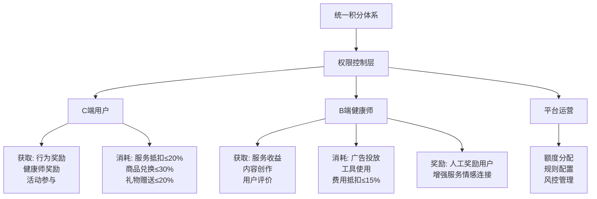
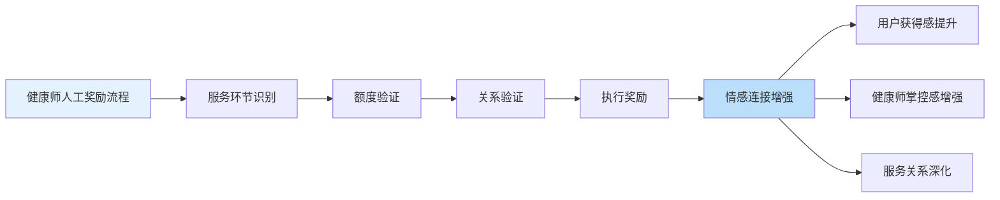
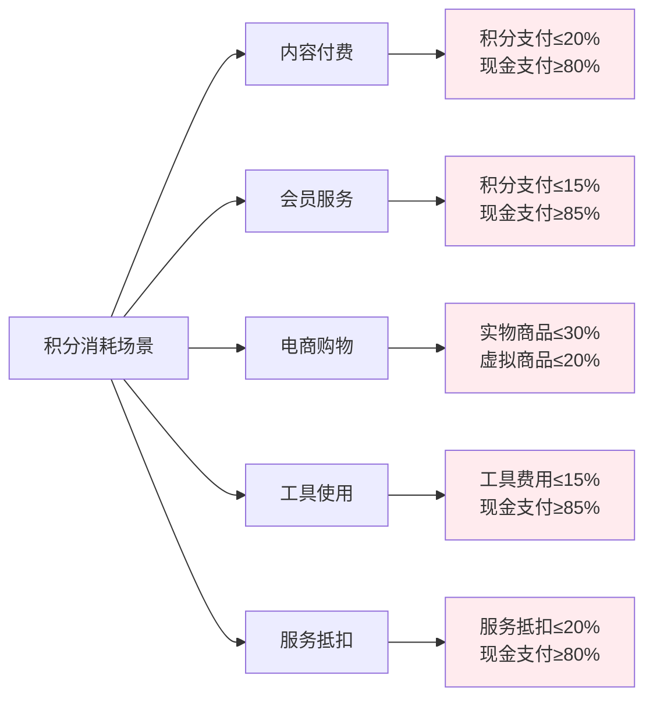
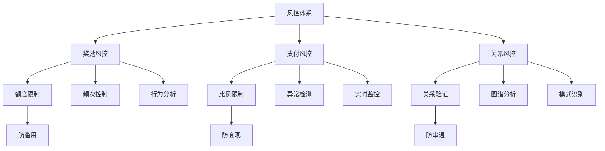
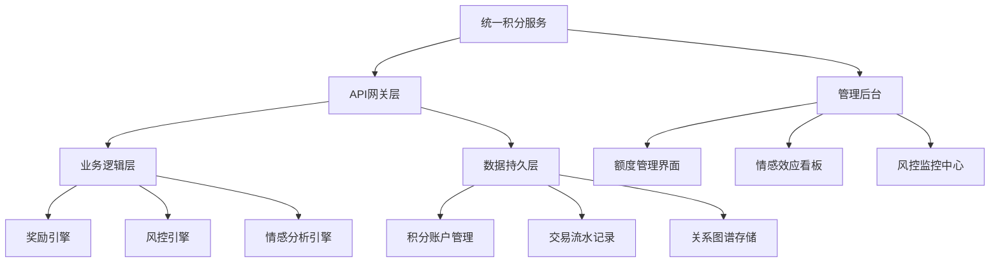
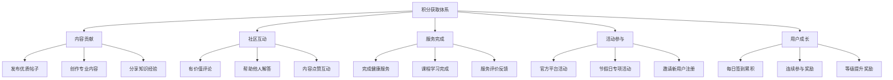
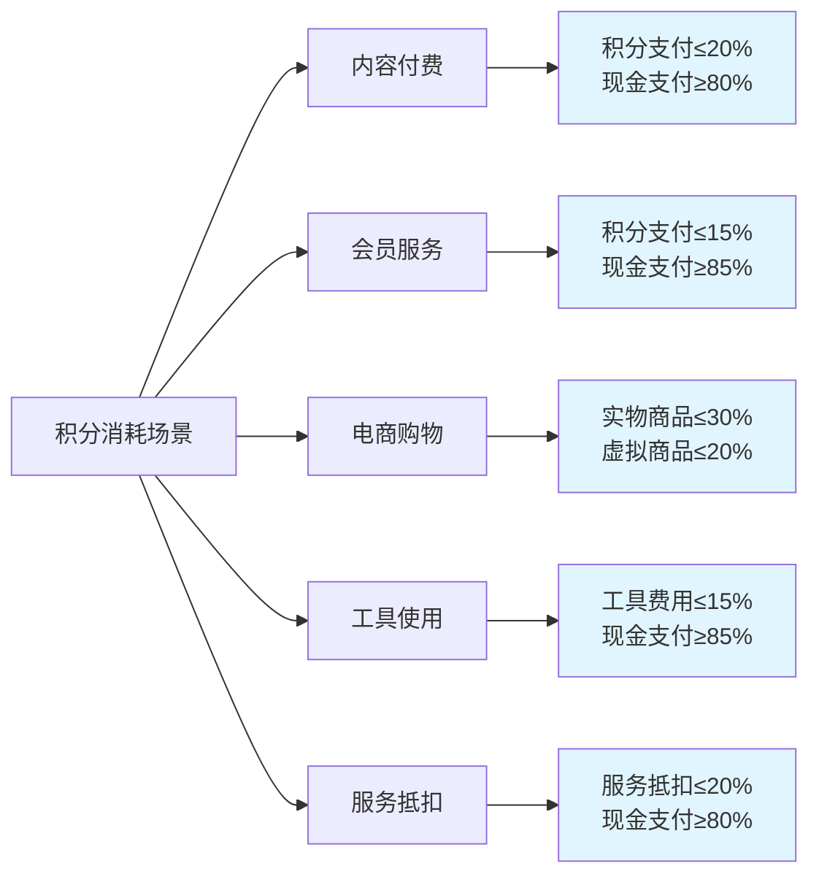
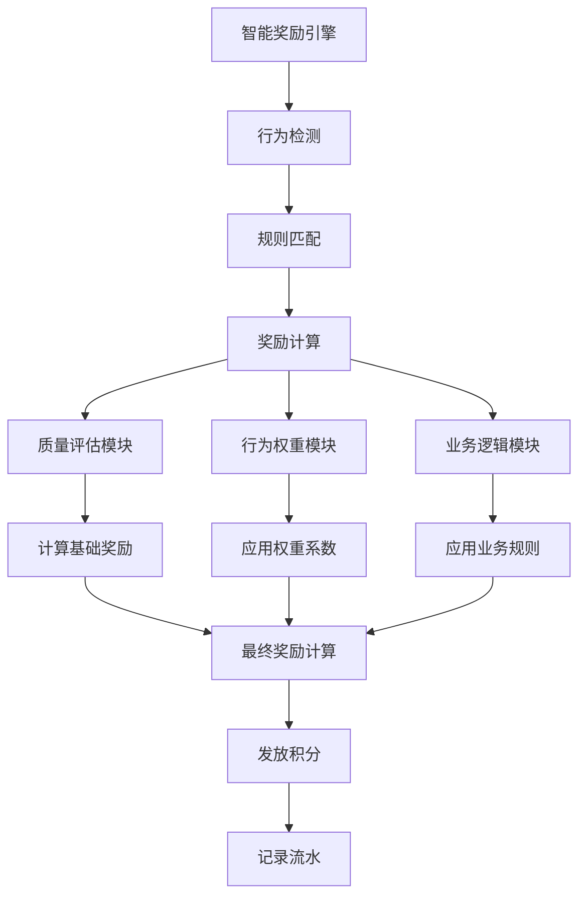
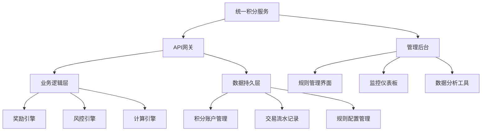

# 平台积分系统设计方案（V5.0 单积分体系+健康师奖励）

## 一、设计思想与原则

1. **统一性原则**：采用单一积分体系，简化用户理解和管理复杂度
2. **情感连接原则**：健康师手动奖励增加业务掌控感，增强C端用户与健康师之间的情感连接
3. **权限差异化原则**：通过角色权限控制实现用户与健康师的差异化功能
4. **风控强化原则**：增强监控和限制机制，防止积分滥用和套现风险
5. **生态平衡原则**：维持积分经济健康度，防止通胀与紧缩
6. **商业可持续原则**：支付场景中积分仅作为促销工具，不影响现金收益
7. **公平透明原则**：所有积分规则公开透明，确保系统公平性

## 二、积分体系架构

### 统一积分体系
| 属性 | 说明 |
|------|------|
| **积分类型** | 统一积分 |
| **通用属性** | 所有用户持有同一积分，通过权限控制差异化功能 |
| **价值锚定** | 1积分 ≈ 0.1元人民币购买力 |
| **有效期** | 24个月（按月分批过期） |
| **核心特色** | 支持健康师人工奖励，增强服务情感连接 |

### 角色权限体系


## 三、积分获取渠道

### 所有用户通用获取方式
- **社区互动**：发帖、评论、点赞、解答问题（按内容质量差异化奖励）
- **官方活动**：参与平台活动、完成任务、节假日活动
- **邀请推广**：邀请新用户注册、成功推荐消费

### C端用户专属获取
- **服务完成**：完成健康服务、课程学习
- **健康师奖励**：接受健康师人工奖励，增强情感连接
- **评价奖励**：提供优质评价获得奖励
- **签到连续**：每日签到累积奖励

### B端健康师专属获取
- **服务收益**：提供咨询服务获得积分收益（平台分润后）
- **内容创作**：发布专业内容获得创作奖励
- **用户好评**：获得用户高评价获得加成奖励
- **平台奖励**：月度绩效奖励、等级提升奖励

## 四、健康师人工奖励系统

### 设计理念
健康师手动奖励功能旨在：
1. **增强掌控感**：让健康师能够主动奖励用户，增强业务主导权
2. **情感连接**：通过积分奖励建立更紧密的用户关系
3. **服务激励**：及时奖励用户积极行为，提升服务体验
4. **个性化关怀**：根据用户表现给予差异化奖励

### 奖励机制


### 额度管理体系
- **月度额度**：平台根据健康师等级分配月度奖励额度
- **额度控制**：每个业务环节设置最大奖励额度
- **清零机制**：每月末未使用额度自动清零
- **灵活调整**：根据绩效动态调整额度

## 五、积分消耗场景与支付比例限制

### 支付场景积分使用规则


### 具体消耗渠道
1. **内容付费**：课程、咨询、专业内容购买
2. **会员服务**：VIP特权、平台会员、专属服务
3. **电商消费**：健康商品、周边产品、实物商品
4. **工具使用**：专业工具、数据分析、客户管理
5. **服务抵扣**：平台费用、服务费用、佣金支付

## 六、平台分润机制

### 分润规则
- **分润范围**：所有通过平台变现的收益（现金+积分）
- **分润时点**：交易完成时实时分润
- **比例可配置**：后台可调整不同业务的分润比例
- **自动化处理**：系统自动计算和分配

### 分润流程
1. 交易完成时系统自动计算总分润金额
2. 优先扣除平台分润部分
3. 剩余部分分配至服务提供方
4. 积分收益自动转换为统一积分

## 七、风控体系

### 多层次风控机制


### 具体风控措施
1. **额度限制**：单日积分获取和消耗额度限制
2. **频次控制**：单日操作频次限制
3. **关系验证**：积分流动前验证服务关系
4. **比例监控**：实时监控支付比例合规性
5. **异常检测**：智能识别异常积分流动模式

## 八、情感化设计特色

### 健康师奖励的情感价值
1. **及时正向反馈**：健康师可即时奖励用户积极行为
2. **个性化关怀**：根据用户特点给予差异化奖励
3. **服务体验提升**：通过积分奖励增强服务满意度
4. **关系纽带强化**：积分作为情感连接的载体

### 用户情感体验
1. **被认可感**：获得健康师直接奖励的心理满足
2. **归属感**：通过积分互动增强平台归属感
3. **激励感**：获得奖励后的持续参与激励
4. **信任感**：健康师主动奖励建立的信任关系

## 九、平台运营后台管理系统

### 健康度监控面板
| 指标类别 | 监控指标 | 健康范围 | 预警阈值 |
|----------|----------|----------|----------|
| **总量指标** | 流通积分总量 | - | 周增长>20% |
| | 积分回收总量 | - | 回收率<30% |
| **流通指标** | 日均发放量 | - | 日波动>25% |
| | 日均消耗量 | - | 日波动>25% |
| | 流通速率 | 0.05-0.15 | <0.03或>0.18 |
| **健康度指标** | 通胀指数 | 0.8-1.2 | >1.5或<0.7 |
| **情感指标** | 人工奖励占比 | 20-40% | <10%或>60% |
| **关系指标** | 奖励互动率 | 30-50% | <20% |

### 运营管理功能
1. **额度管理**：健康师额度分配和调整
2. **规则配置**：积分规则灵活配置
3. **风控设置**：风控规则和阈值管理
4. **数据监控**：实时数据监控和预警
5. **情感分析**：奖励情感效应分析

## 十、技术实现方案

### 系统架构


### 核心接口设计
```python
# 健康师人工奖励接口
class ManualRewardController(http.Controller):
    
    @http.route('/api/points/manual-reward', type='json', auth='user')
    def manual_reward(self, user_id, points, scene, reason=None):
        """
        健康师人工奖励接口
        :param user_id: 奖励用户ID
        :param points: 奖励积分
        :param scene: 奖励场景
        :param reason: 奖励原因（情感化描述）
        """
        # 验证健康师身份和权限
        if not request.env.user.has_group('health_platform.group_health_worker'):
            return {'error': '无操作权限'}
        
        # 验证服务关系
        relationship = request.env['service.relationship'].search([
            ('health_worker_id', '=', request.env.user.id),
            ('user_id', '=', user_id),
            ('status', '=', 'active')
        ])
        
        if not relationship:
            return {'error': '无有效服务关系'}
        
        # 检查额度
        quota_pool = request.env['quota.pool'].search([
            ('health_worker_id', '=', request.env.user.id)
        ])
        
        if quota_pool.remaining_quota < points:
            return {'error': '额度不足'}
        
        # 执行奖励
        reward_service = request.env['points.reward.service']
        result = reward_service.execute_manual_reward(
            request.env.user.id, user_id, points, scene, reason
        )
        
        return {
            'success': True,
            'transaction_id': result['transaction_id'],
            'remaining_quota': result['remaining_quota'],
            'message': '奖励成功'
        }
```

## 十一、实施与推广策略

### 阶段化实施
1. **第一阶段**：核心积分系统上线
2. **第二阶段**：健康师人工奖励功能启用
3. **第三阶段**：情感化功能优化增强
4. **第四阶段**：全面推广和运营优化

### 健康师培训计划
1. **奖励策略培训**：如何有效使用积分奖励
2. **情感沟通培训**：通过积分建立情感连接
3. **额度管理培训**：合理使用月度额度
4. **效果分析培训**：分析奖励效果优化策略

### 用户引导策略
1. **奖励通知优化**：情感化奖励通知设计
2. **积分教育**：积分价值和使用指南
3. **情感互动鼓励**：鼓励用户与健康师互动
4. **成功案例分享**：分享优秀奖励案例

## 十二、预期效果评估

### 量化指标
| 指标类型 | 预期目标 | 评估周期 |
|----------|----------|----------|
| **用户参与度** | 提升20-30% | 月度 |
| **服务满意度** | 提升15-25% | 季度 |
| **健康师活跃度** | 提升25-35% | 月度 |
| **积分健康度** | 保持0.8-1.2 | 实时 |
| **情感连接指数** | 提升30-40% | 半年度 |

### 质性效果
1. **用户关系深化**：建立更紧密的服务关系
2. **服务体验提升**：通过积分奖励提升体验
3. **平台粘性增强**：提高用户留存和活跃度
4. **业务价值提升**：通过情感连接创造业务价值

本方案通过单积分体系结合健康师人工奖励功能，在保持系统简洁性的同时，增强了健康师与用户之间的情感连接，为平台创造了独特的情感价值竞争优势。


-----------------

或者，可以在第一阶段先实现以下方案，即，将健康师手动奖励的部分修改为系统自动奖励，然后，第二阶段迭代开发升级为以上方案：

-------------


# 平台积分系统设计方案（V5.1 单积分无健康师奖励，而是系统自动奖励）

## 一、设计思想与原则

1. **统一性原则**：单一积分体系，极大简化用户理解和管理复杂度
2. **自动化原则**：积分获取完全系统自动化，无需人工干预
3. **公平性原则**：所有奖励基于标准化规则，确保公平一致
4. **风控简化原则**：减少人为干预点，降低风控复杂度
5. **功能完整性原则**：保留所有支付、兑换、消费功能
6. **商业可持续原则**：支付场景中积分仅作为促销工具，不影响现金收益

## 二、积分体系架构

### 统一积分体系
| 属性 | 说明 |
|------|------|
| **积分类型** | 统一积分 |
| **获取方式** | 纯系统自动化奖励 |
| **核心功能** | 支付抵扣、商品兑换、服务消费 |
| **价值锚定** | 1积分 ≈ 0.1元人民币购买力 |
| **有效期** | 24个月（按月分批过期） |

## 三、积分获取渠道

### 系统自动化奖励渠道


### 奖励规则特点
1. **完全自动化**：所有奖励由系统自动触发和发放
2. **规则标准化**：基于明确规则而非人工判断
3. **质量导向**：奖励金额与内容质量挂钩
4. **防刷机制**：同类行为重复执行积分递减

## 四、积分消耗场景与支付比例限制

### 支付场景积分使用规则


### 具体消耗渠道
1. **内容付费**：课程、咨询、专业内容购买
2. **会员服务**：VIP特权、平台会员、专属服务
3. **电商消费**：健康商品、周边产品、实物商品
4. **工具使用**：专业工具、数据分析、客户管理
5. **服务抵扣**：平台费用、服务费用、佣金支付

## 五、平台分润机制

### 分润规则
- **分润范围**：所有通过平台变现的收益（现金+积分）
- **分润时点**：交易完成时实时分润
- **比例可配置**：后台可调整不同业务的分润比例
- **自动化处理**：系统自动计算和分配

### 分润流程
1. 交易完成时系统自动计算总分润金额
2. 优先扣除平台分润部分
3. 剩余部分分配至服务提供方
4. 积分收益自动转换为统一积分

## 六、风控体系

### 自动化风控重点
1. **奖励发放风控**：
   - 防止自动化奖励被滥用
   - 检测异常行为模式
   - 防止机器人刷分

2. **支付风控**：
   - 支付比例限制执行
   - 防套现机制监控
   - 异常交易检测

3. **基础风控**：
   - 用户身份验证
   - 基础关系验证
   - 交易安全保护

### 风控措施
1. **频次限制**：单日同类行为奖励次数限制
2. **额度限制**：单日积分获取总额限制
3. **质量检测**：内容质量审核后才发放奖励
4. **行为分析**：监控异常积分获取模式

## 七、平台运营后台管理系统

### 健康度监控面板
| 指标类别 | 监控指标 | 健康范围 | 预警阈值 |
|----------|----------|----------|----------|
| **总量指标** | 流通积分总量 | - | 周增长>20% |
| | 积分回收总量 | - | 回收率<30% |
| **流通指标** | 日均发放量 | - | 日波动>25% |
| | 日均消耗量 | - | 日波动>25% |
| | 流通速率 | 0.05-0.15 | <0.03或>0.18 |
| **健康度指标** | 通胀指数 | 0.8-1.2 | >1.5或<0.7 |
| **支付比例指标** | 比例合规率 | 100% | <99.5% |

### 运营管理功能
1. **规则管理**：积分奖励规则配置和管理
2. **比例管理**：支付比例规则配置
3. **风控管理**：风控规则和阈值配置
4. **数据监控**：实时数据监控和预警
5. **报表分析**：多维度数据分析和报表

## 八、智能奖励引擎

### 规则架构


### 核心规则类型
1. **行为奖励规则**：标准化行为对应标准奖励
2. **质量加成规则**：基于质量的奖励加成
3. **连续参与规则**：连续参与的额外奖励
4. **等级特权规则**：基于等级的特权奖励

## 九、技术实现方案

### 系统架构


### 核心接口
```javascript
// 积分奖励接口（系统自动化）
POST /api/v5/points/auto-reward
{
  user_id: string,
  behavior_type: string, // 行为类型
  content_id: string, // 内容ID
  quality_score: number // 质量评分
}

// 积分支付验证接口
POST /api/v5/payment/validate
{
  user_id: string,
  points_amount: number, // 积分金额
  cash_amount: number, // 现金金额
  scene: string // 支付场景
}

// 健康度查询接口
GET /api/v5/points/health-status
{
  time_range: string,
  metrics: string[]
}
```

## 十、版本特点总结

### V5.1核心特点
1. **极致简化**：单一积分体系，无人工奖励功能
2. **全自动化**：积分获取完全系统自动化
3. **规则驱动**：基于标准化规则而非人工判断
4. **风控简化**：大幅减少风控复杂点
5. **功能完整**：保留所有支付兑换功能

### 移除的功能
1. **健康师奖励按钮**：完全移除
2. **额度池系统**：完全移除
3. **人工奖励审核**：完全移除
4. **复杂关系风控**：大幅简化

### 保留的功能
1. **所有支付功能**：完整保留
2. **所有兑换功能**：完整保留
3. **所有消费场景**：完整保留
4. **分润机制**：完整保留并优化

## 十一、实施保障

### 数据迁移方案
1. **用户积分**：保持现有积分余额不变
2. **奖励记录**：保留历史奖励记录
3. **系统切换**：无感知平滑切换

### 运营过渡方案
1. **用户沟通**：提前通知系统变更
2. **规则公示**：明确公示新奖励规则
3. **过渡支持**：提供过渡期指导和支持
4. **反馈机制**：建立用户反馈和优化机制

本方案通过移除健康师积分奖励功能，实现了系统的极致简化和自动化，在保持所有核心功能完整的同时，显著降低了系统复杂度和运营成本。

----
