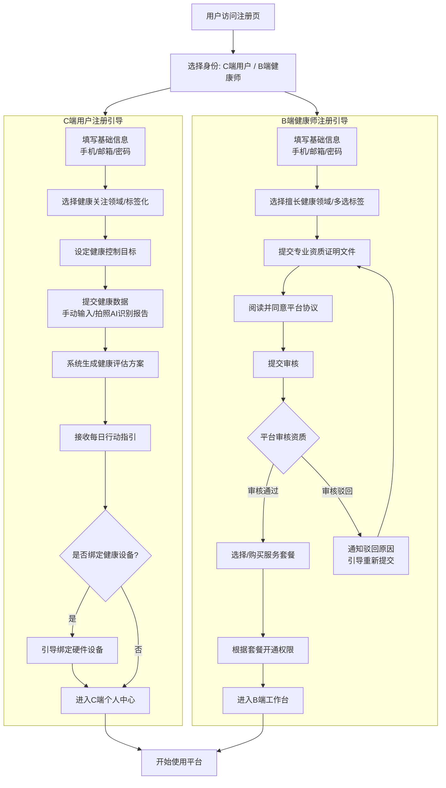

### 一、详细的C端与B端注册引导流程图（Mermaid）

```mermaid
flowchart TD
    Start[用户访问注册页] --> IdentitySelection[选择身份: C端用户 / B端健康师]

    IdentitySelection --> C_Flow[C端用户流程]
    IdentitySelection --> B_Flow[B端健康师流程]

    subgraph C_Flow [C端用户注册引导]
        direction TB
        C1[填写基础信息<br>手机/邮箱/密码] --> C2[选择健康关注领域/标签化] --> C3[设定健康控制目标] --> C4[提交健康数据<br>手动输入/拍照AI识别报告] --> C5[系统生成健康评估方案] --> C6[接收每日行动指引] --> C7{是否绑定健康设备?}
        C7 -->|是| C8[引导绑定硬件设备] --> C9[进入C端个人中心]
        C7 -->|否| C9
    end

    subgraph B_Flow [B端健康师注册引导]
        direction TB
        B1[填写基础信息<br>手机/邮箱/密码] --> B2[选择擅长健康领域/多选标签] --> B3[提交专业资质证明文件] --> B4[阅读并同意平台协议] --> B5[提交审核]
        B5 --> B6{平台审核资质}
        B6 -->|审核通过| B7[选择/购买服务套餐] --> B8[根据套餐开通权限] --> B9[进入B端工作台]
        B6 -->|审核驳回| B10[通知驳回原因<br>引导重新提交] --> B3
    end

    C9 --> Final[开始使用平台]
    B9 --> Final
```

**流程说明：**
- **C端流程**：侧重于快速建立用户健康画像，通过引导填写信息、选择标签、设定目标和提交数据，最终生成个性化健康方案并引导至个人中心。
- **B端流程**：侧重于资质审核与商业化开通，通过选择擅长领域、提交资质、等待审核、选择套餐等步骤，最终根据套餐权限进入工作台。

