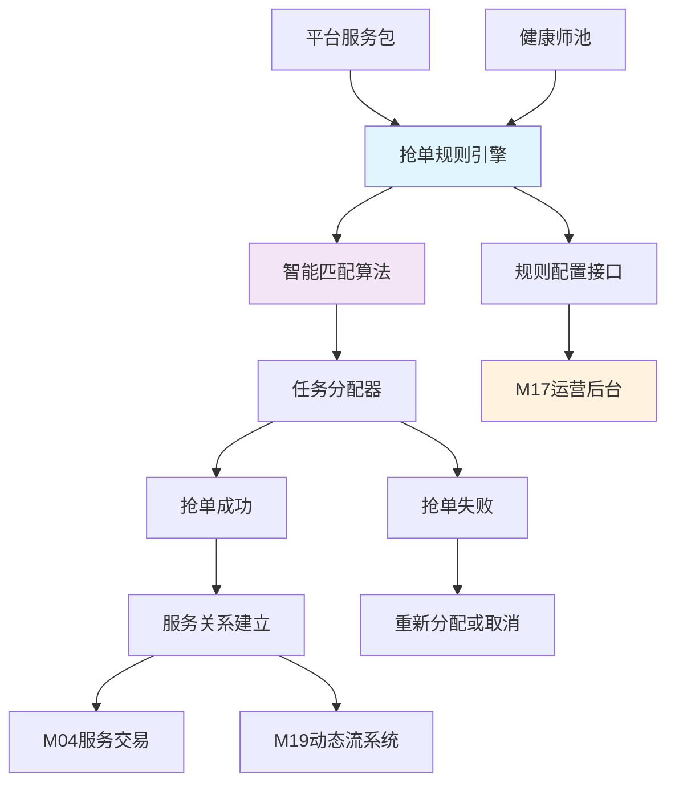

### M20: 抢单与任务分配系统 (V3.1)

#### 模块描述
专门处理平台服务包的抢单逻辑和任务分配的核心引擎，确保平台服务包能够高效、公平地分配给合适的健康师，提升平台服务效率和健康师收入机会。

#### 核心业务目标
- 建立公平、透明的抢单机制，优化平台服务包的分配效率
- 通过智能匹配算法将服务包与最适合的健康师进行匹配
- 为平台运营提供灵活的规则配置和实时监控能力

#### 二级模块与功能清单

| 二级功能模块 | 三级功能模块 | 四级功能点（高度细化） | 健康师 | 平台业务运营 | 平台服务运营 | 功能描述 |
|------------|------------|---------------------|--------|--------------|--------------|----------|
| **服务包管理** | 服务包创建 | 创建标准化平台服务包模板 | -- | ✅ | ✅ | 平台服务包的创建和配置管理 |
| | | 设置服务包基本信息（名称、描述、价格） | -- | ✅ | ✅ | |
| | | 配置服务包健康问题分类 | -- | ✅ | ✅ | |
| | | 设置服务包服务标准和流程 | -- | ✅ | ✅ | |
| | | **【新增】服务包复制功能** | -- | ✅ | ✅ | **【新增】** 快速基于现有服务包创建新包 |
| | 服务包发布 | 设置服务包发布时间和有效期 | -- | ✅ | ✅ | |
| | | 配置服务包抢单规则 | -- | ✅ | ✅ | |
| | | 设置服务包最大接单数量 | -- | ✅ | ✅ | |
| | | **【新增】服务包批量发布** | -- | ✅ | ✅ | **【新增】** 一次性发布多个相关服务包 |
| **抢单规则引擎** | 资格验证 | 健康师等级要求验证 | ✅ | ✅ | ✅ | 抢单参与资格的自动验证 |
| | | 擅长领域匹配度验证 | ✅ | ✅ | ✅ | |
| | | 服务能力饱和度检查 | ✅ | ✅ | ✅ | |
| | | 信用记录审查 | ✅ | ✅ | ✅ | |
| | | **【新增】实时资格监控** | ✅ | ✅ | ✅ | **【新增】** 抢单过程中实时监控资格变化 |
| | 匹配算法 | 基于擅长领域的精准匹配 | ✅ | ✅ | ✅ | 服务包与健康师的智能匹配 |
| | | 基于历史表现的质量匹配 | ✅ | ✅ | ✅ | |
| | | 基于响应速度的时效匹配 | ✅ | ✅ | ✅ | |
| | | 基于地理位置的区域匹配 | ✅ | ✅ | ✅ | |
| | | **【新增】多维度综合评分** | ✅ | ✅ | ✅ | **【新增】** 综合考虑多个因素的匹配评分 |
| | 分配机制 | 先到先得分配模式 | ✅ | ✅ | ✅ | 服务包的具体分配逻辑 |
| | | 质量优先分配模式 | ✅ | ✅ | ✅ | |
| | | 平台指派分配模式 | ✅ | ✅ | ✅ | |
| | | 混合分配模式 | ✅ | ✅ | ✅ | |
| | | **【新增】智能轮询分配** | ✅ | ✅ | ✅ | **【新增】** 保证新健康师也有机会的分配机制 |
| **抢单任务推送** | 推送策略 | 基于健康师专长的精准推送 | ✅ | ✅ | ✅ | 抢单任务的通知和推送管理 |
| | | 基于活跃时间的智能推送 | ✅ | ✅ | ✅ | |
| | | 推送频次和数量控制 | ✅ | ✅ | ✅ | |
| | | 推送优先级管理 | ✅ | ✅ | ✅ | |
| | | **【新增】推送效果优化** | ✅ | ✅ | ✅ | **【新增】** 基于历史响应的推送策略优化 |
| | 通知管理 | 抢单机会站内通知 | ✅ | ✅ | ✅ | |
| | | 抢单机会推送通知 | ✅ | ✅ | ✅ | |
| | | 抢单结果通知 | ✅ | ✅ | ✅ | |
| | | **【新增】智能提醒机制** | ✅ | ✅ | ✅ | **【新增】** 重要抢单机会的强化提醒 |
| **抢单执行流程** | 抢单申请 | 健康师查看抢单任务详情 | ✅ | ✅ | ✅ | 抢单的具体执行过程 |
| | | 一键抢单功能 | ✅ | ✅ | ✅ | |
| | | 抢单前的最终资格校验 | ✅ | ✅ | ✅ | |
| | | 抢单申请提交 | ✅ | ✅ | ✅ | |
| | | **【新增】抢单意愿表达** | ✅ | ✅ | ✅ | **【新增】** 预先表达对某类任务的兴趣 |
| | 订单分配 | 自动分配规则执行 | ✅ | ✅ | ✅ | |
| | | 分配结果实时通知 | ✅ | ✅ | ✅ | |
| | | 分配失败处理机制 | ✅ | ✅ | ✅ | |
| | | **【新增】分配结果申诉** | ✅ | ✅ | ✅ | **【新增】** 健康师对分配结果的申诉渠道 |
| | 服务启动 | 分配后自动建立服务关系 | ✅ | ✅ | ✅ | |
| | | 服务流程标准化启动 | ✅ | ✅ | ✅ | |
| | | 服务进度跟踪 | ✅ | ✅ | ✅ | |
| | | **【新增】服务交接支持** | ✅ | ✅ | ✅ | **【新增】** 特殊情况下服务交接机制 |
| **绩效与质量管理** | 抢单绩效 | 抢单成功率统计 | ✅ | ✅ | ✅ | 抢单业务的质量和效果评估 |
| | | 响应时间分析 | ✅ | ✅ | ✅ | |
| | | 完成质量评估 | ✅ | ✅ | ✅ | |
| | | 用户满意度跟踪 | ✅ | ✅ | ✅ | |
| | | **【新增】绩效趋势分析** | ✅ | ✅ | ✅ | **【新增】** 长期绩效变化趋势分析 |
| | 质量监控 | 服务过程质量监控 | ✅ | ✅ | ✅ | |
| | | 异常服务预警 | ✅ | ✅ | ✅ | |
| | | 服务质量改进建议 | ✅ | ✅ | ✅ | |
| | | **【新增】质量标杆树立** | ✅ | ✅ | ✅ | **【新增】** 优质服务案例分享和学习 |
| **风控与合规** | 风险控制 | 刷单行为检测 | ✅ | ✅ | ✅ | 抢单业务的风险管理 |
| | | 合谋抢单防范 | ✅ | ✅ | ✅ | |
| | | 服务能力超负荷预警 | ✅ | ✅ | ✅ | |
| | | **【新增】风险画像构建** | ✅ | ✅ | ✅ | **【新增】** 基于行为的风控画像系统 |
| | 纠纷处理 | 抢单纠纷申诉渠道 | ✅ | ✅ | ✅ | |
| | | 纠纷仲裁机制 | ✅ | ✅ | ✅ | |
| | | 处理结果执行 | ✅ | ✅ | ✅ | |
| | | **【新增】纠纷预防机制** | ✅ | ✅ | ✅ | **【新增】** 通过规则优化预防纠纷 |
| **数据分析和优化** | 业务分析 | 抢单业务整体数据看板 | ✅ | ✅ | ✅ | 抢单业务的数据分析和优化 |
| | | 各服务包抢单情况分析 | ✅ | ✅ | ✅ | |
| | | 健康师抢单行为分析 | ✅ | ✅ | ✅ | |
| | | 抢单转化率分析 | ✅ | ✅ | ✅ | |
| | | **【新增】预测性分析** | ✅ | ✅ | ✅ | **【新增】** 预测未来抢单需求和趋势 |
| | 规则优化 | A/B测试规则效果 | ✅ | ✅ | ✅ | |
| | | 规则调整影响模拟 | ✅ | ✅ | ✅ | |
| | | 规则版本管理 | ✅ | ✅ | ✅ | |
| | | **【新增】自动化规则优化** | ✅ | ✅ | ✅ | **【新增】** 基于数据自动优化规则参数 |
| **系统集成** | **【新增】与M04集成** | 服务包信息同步 | ✅ | ✅ | ✅ | **【新增】** 与健康服务交易市场深度集成 |
| | **【新增】与M05集成** | 健康师等级数据同步 | ✅ | ✅ | ✅ | **【新增】** 与成长认证体系集成 |
| | **【新增】与M17集成** | 运营规则配置同步 | ✅ | ✅ | ✅ | **【新增】** 与运营后台管理集成 |
| | **【新增】与M19集成** | 抢单动态信息同步 | ✅ | ✅ | ✅ | **【新增】** 与动态流系统集成 |

#### 抢单资格验证规则
| 验证维度 | 验证规则 | 可配置 | 自动执行 |
|---------|---------|--------|----------|
| **健康师等级** | 达到服务包要求的最低等级 | ✅ | ✅ |
| **擅长领域** | 与服务包健康问题分类匹配 | ✅ | ✅ |
| **服务饱和度** | 当前服务量未超过上限 | ✅ | ✅ |
| **信用记录** | 无重大违规和投诉记录 | ✅ | ✅ |
| **响应速度** | 历史平均响应时间达标 | ✅ | ✅ |

#### 抢单分配算法权重配置
| 分配因素 | 权重范围 | 默认权重 | 可调整 |
|---------|---------|----------|--------|
| **响应速度** | 0-30% | 15% | ✅ |
| **历史评分** | 0-40% | 25% | ✅ |
| **专业匹配度** | 0-50% | 30% | ✅ |
| **服务完成率** | 0-30% | 20% | ✅ |
| **地域 proximity** | 0-20% | 10% | ✅ |

#### 主要更新点 (V3.1)
1. **完善服务包管理**：新增服务包复制、批量发布等效率工具
2. **增强规则引擎**：新增实时资格监控、多维度综合评分等智能功能
3. **优化推送策略**：新增推送效果优化、智能提醒等精准推送能力
4. **完善执行流程**：新增抢单意愿表达、分配结果申诉等用户体验优化
5. **强化质量管理**：新增绩效趋势分析、质量标杆树立等质量提升措施
6. **加强风控能力**：新增风险画像构建、纠纷预防机制等风险管理功能
7. **深化系统集成**：与M04、M05、M17、M19等模块的深度集成

---

### M20系统架构图

M20抢单与任务分配系统作为平台服务包业务的核心引擎，通过智能化的匹配算法和公平的分配机制，确保平台服务包能够高效分配给最合适的健康师，提升整体服务效率和用户体验。

---
